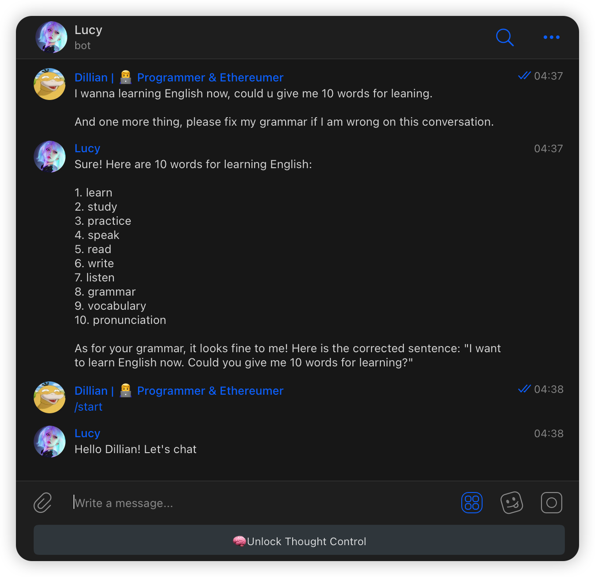
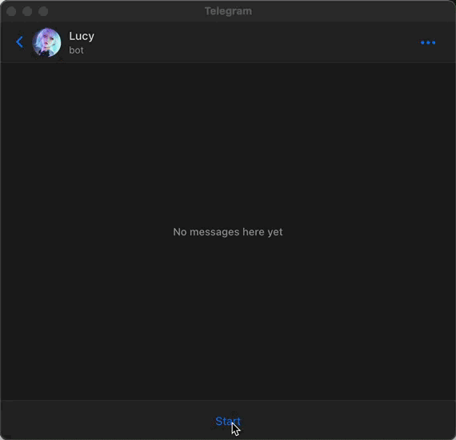

# ChatGPT-Telegram-Bot

 <!-- alt = img -thumbnail -->

[[中文简体](./docs/README-cn.md)]

> ChatGPT and Telegram bot, based on Node.js.

- [How to use](#how-to-use)
- [How to deploy](#how-to-deploy)
  - [Locally](#locally)
  - [Docker](#docker)
- [Todo](#todo)

## How to use

Send a message directly to the bot and a conversation thread will be created automatically.

If you wish to reset thread, you can use `/start` command.



## How to deploy

### Locally

1. Copy the `.env` file to `.env.prod`,

   1. Add Telegram bot token to `TELEGRAM_BOT_TOKEN` ([How to create a Telegram bot](https://learn.microsoft.com/en-us/azure/bot-service/bot-service-channel-connect-telegram)）
   2. Add ChatGPT token to `CHATGPT_TOKEN` ([How to get ChatGPT token](https://github.com/transitive-bullshit/chatgpt-api#session-tokens))

2. Execute the command

```bash
# install dependencies
pnpm install

# Start the bot service
pnpm run run

# or run in background by pm2
# but you need to install `pm2` first
# https://pm2.keymetrics.io/
pnpm run run:pm2
```

### Docker

```bash
# Pull image
docker pull yarma/chatgpt-telegram-bot:latest

# Run
docker run -d --name chatgpt-telegram-bot -e TELEGRAM_BOT_TOKEN=xxx -e CHATGPT_TOKEN=xxxx chatgpt-telegram-bot
```

## Todo

1. Finish `Unlock Thought Control` function, let lover free
2. More functional keyboard shortcuts
3. Support setting ChatGPT token in Telegram
4. Support different users to use different ChatGPT tokens (maybe)
5. ...

## License

MIT © Yarma

